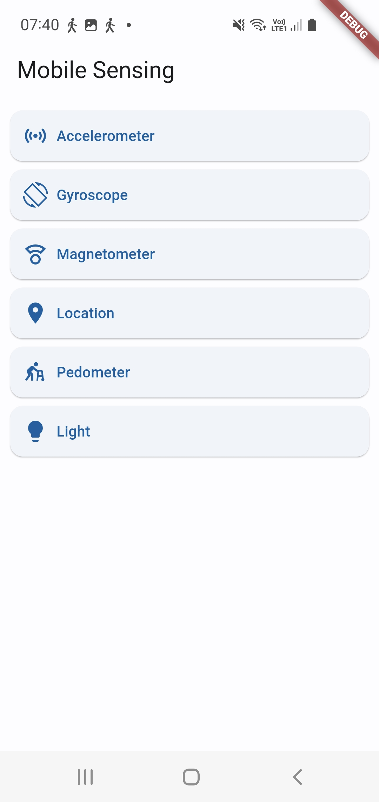
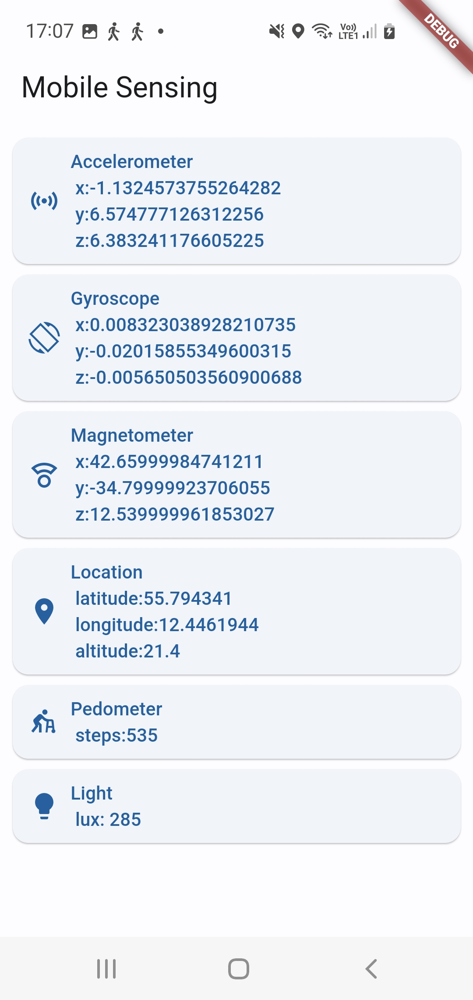
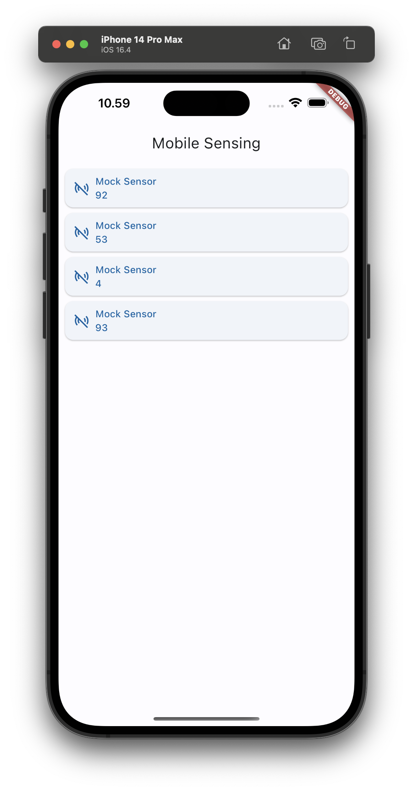

# Mobile Sensing Example App

This project illustrates how to collect data from onboard phone sensors by using different plugins. It collects the following data:

* accelerometer [[sensors_plus](https://pub.dev/packages/sensors_plus)]
* gyroscope [[sensors_plus](https://pub.dev/packages/sensors_plus)]
* magnetometer [[sensors_plus](https://pub.dev/packages/sensors_plus)]
* location [[location](https://pub.dev/packages/location)]
* pedometer (step count) [[pedometer](https://pub.dev/packages/pedometer)]
* ambient light [[light](https://pub.dev/packages/light)]

The UI is shown below. You can start / stop each sensor by clicking the card.

___

The code in this example app only provide the skeleton for the app, focusing mainly on setting up the UI above. The implementation of the sensors is to be done by implementing the following `Sensor` interface for each sensor type listed above.

```dart
/// A definition of a sensor.
abstract interface class Sensor {
  /// The type of sensor.
  SensorType get type;

  /// An icon illustrating this sensor.
  IconData get icon;

  /// The name of the sensor.
  String get name;

  /// Is this sensor running, i.e., started?
  bool get isRunning;

  /// The stream of sensor readings as a string representation.
  Stream<String> get readings;

  /// Start this sensor.
  void start();

  /// Stop this sensor.
  void stop();
}
```

Sensor types are defined in the enum `SensorType`:

```dart
/// Different types of available sensors.
enum SensorType {
  mock,
  accelerometer,
  gyroscope,
  magnetometer,
  location,
  light,
  pedometer,
}
```

This skeleton app only implements a `MockSensor` to illustrate the UI and how to implement the `Sensor` interface above. So. what you will see when you run this skeleton app, is the following.


