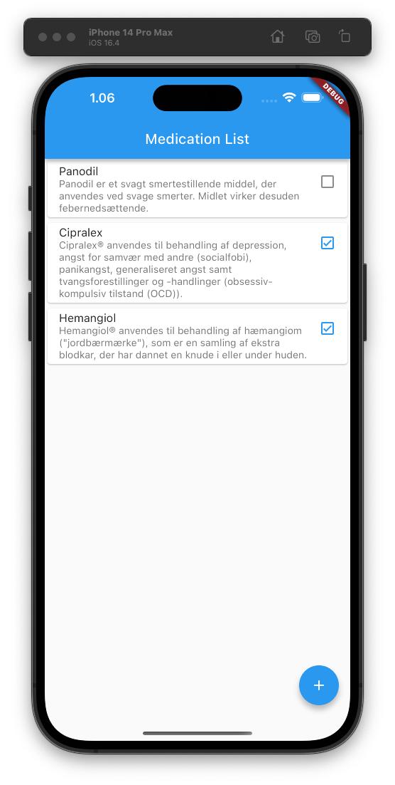
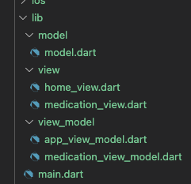

# Model-View-ViewModel Example using Design Patterns

This in an example of how to design your app to follow the [Model–View–ViewModel](https://en.wikipedia.org/wiki/Model%E2%80%93view%E2%80%93viewmodel) software architecture while combining this with other [Software Design Patterns](https://en.wikipedia.org/wiki/Software_design_pattern).

## User Interface

This simple example app shows a list of medication using a [`ListView`](https://api.flutter.dev/flutter/widgets/ListView-class.html) widget, as shown below. When the user presses the "+" button, an additional medication (the "Hemangiol") is added to the list.

 

## Model-View-ViewModel Architecture

 The overall architecture of the app follows the Model-View-ViewModel architecture, which entails that you divide ("separate") your app into three main types of components:


In our case, the Model contains the domain knowledge of the device(s), and the View contains all the Flutter widgets, and the ViewModel contains and enriches data from the Model to be shown in the View. In a Flutter app, a MVVM architecture is typically implemented by having "model", "view", and "view_model" folders in your app structure, like this:



The you create classes and dart files for;

* model(s) (sometimes just one BIG model)
* views
* view models for each view

Finally, you can use the `library` construct in Dart to bundle the entire app together;


Each type of component have different responsibilities:

* `Model` - The model is holding the “raw” data model and is divided into different model classes. The model knows where to get data and where to store data, e.g., in a database or a server, and knows about data formats, like JSON. See the [`model.dart`](https://github.com/bardram/teaching_digital_mobile_health/blob/main/mvvm_patterns/lib/model/model.dart) as an example.

* `ViewModel` - The view model is created knowing its model using “dependency injection”, which is typically done in the constructor. The view model is responsible for providing access to the data that “its” view model should be able to show and for updating the model based on user input from the view. See the [`medication_view_model.dart`](https://github.com/bardram/teaching_digital_mobile_health/blob/main/mvvm_patterns/lib/view_model/medication_view_model.dart) as an example.

* `View` - The view is created knowing its view model using “dependency injection” done in the constructor. The view is responsible for showing its data in the view model, which is done using the `State` of a `StatefulWidget`. The view is also responsible for mapping user input (like a button or text input) to the view model done by calling methods on the view model. See the [`medication_view.dart`](https://github.com/bardram/teaching_digital_mobile_health/blob/main/mvvm_patterns/lib/view/medication_view.dart) as an example.

## Design Patterns

This app also illustrates the use of different GoF Software Design Patterns.

### Singleton

In the app, the `MedicationBLoc` works as a singleton so that this BLoc can be accessed across the entire app. Note that the recommended way to create a singleton in Dart is to use the default constructor - in this case `MedicationBLoc()`. This is implemented using a static final private instance property, named `_instance`, creating a private constructor called `MedicationBLoc._()`, and a factory called `MedicationBLoc()` that returns the instance. This is  shown below.

```dart
/// A BLoc singleton that can be used across the entire app.
class MedicationBLoc {
  static final MedicationBLoc _instance = MedicationBLoc._();
  MedicationBLoc._();
  factory MedicationBLoc() => _instance;

  /// The title of the app.
  String get title => 'Medication List';

  /// The list of [Medication] to be shown in the app.
  MedicationList get medications => ...;

}
```

Now, this singleton BLoc can be accessed across the entire app, such as in a `build` method.

```dart
  @override
  Widget build(BuildContext context) => MaterialApp(
        home: HomeView(
          model: AppViewModel(
            MedicationBLoc().title,
            MedicationBLoc().medications,
          ),
        ),
      );
```

### Observer

The `model` folder holds a simple implementation of the GoF Observer pattern.

```dart
/// An object that maintains a list of observers.
/// Implements the Observer GoF pattern.
class Subject {
  final List<Observer> _observers = [];

  /// Add the [observer] to the list of observers for this subject.
  void adObserver(Observer observer) => _observers.add(observer);

  /// Remove the [observer].
  bool removeObserver(Observer observer) => _observers.remove(observer);

  /// Notify all the registered observers by calling their [update] method.
  /// Call this method whenever this subject changes, to notify any observers
  /// that this object may have changed.
  void notify() {
    for (var observer in _observers) {
      observer.update();
    }
  }
}

/// Defines classes that can observer a [Subject].
/// Implements the Observer GoF pattern.
abstract interface class Observer {
  /// Call-back method called when the subject that this observer observes, changes.
  void update();
}
```

However, this implementation is actually not used in the example app. Instead, the Flutter build-in [`ChangeNotifier`](https://api.flutter.dev/flutter/foundation/ChangeNotifier-class.html) is used in the view models, and the [`ListenableBuilder`](https://api.flutter.dev/flutter/widgets/ListenableBuilder-class.html) is used in the views to keep them updated based on changes in the view models.

The `MedicationViewModel` now extends the `ChangeNotifier` class and can notify its listeners via the `notifyListeners()` method.

```dart
class MedicationViewModel extends ChangeNotifier {
  Medication medication;
  MedicationViewModel(this.medication);

  /// Mark if this medication has been taken or not.
  void taken(bool value) {
    medication.taken = value;
    notifyListeners();
  }
}
```

Now in the `MedicationViewState` we use a `ListenableBuilder` that listen to the widget's model and rebuilds whenever it is notified (via the `notifyListeners()` method). Note that we no longer need the `setState()` for notifying Flutter to rebuild the UI.

```dart
class MedicationViewState extends State<MedicationView> {
  @override
  Widget build(BuildContext context) => Card(
        child: ListTile(
          title: Text(widget.model.medication.name),
          subtitle: Text(widget.model.medication.description),
          trailing: ListenableBuilder(
              listenable: widget.model,
              builder: (BuildContext context, Widget? child) =>
                  widget.model.medication.taken
                      ? const Icon(
                          Icons.check_box_outlined,
                          size: 24.0,
                          color: Colors.blue,
                        )
                      : const Icon(
                          Icons.check_box_outline_blank,
                          size: 24.0,
                        )),
          onTap: medicationTaken,
        ),
      );

  void medicationTaken() =>
      widget.model.taken(widget.model.medication.taken ? false : true);
}
```

### Facade

In this app there is a very simple facade called `MedicationSystem`. It provides a simple interface for getting a list of medications and for adding (prescribing) medication for a patient. Then, detailed implementation for specific medication mangement systems can then implement this interface. For example, support for the Danish [Fælles Medicin Kort (FMK)](https://www.fmk-teknik.dk/index.php) can be made, and all the ugly details of how that work, can be "hidden" in the `FMKMedicationSystem` class.

```dart
part of medication_app;

/// A definition of what external medication systems can.
/// Works as a facade definitions for complex external systems.
abstract interface class MedicationSystem {
  /// Get a list of prescribed medication for a [patientId].
  List<Medication> getMedication(String patientId);

  /// Add [medication] for a patient with id [patientId].
  /// Return true if successful, false otherwise.
  bool addMedication(String patientId, Medication medication);
}

/// Medication System Facade implementation for the Danish Fælles Medicin
/// Kort (FMK).
class FMKMedicationSystem implements MedicationSystem {
  @override
  bool addMedication(String patientId, Medication medication) {
    // TODO: implement addMedication
  }

  @override
  List<Medication> getMedication(String patientId) {
    // TODO: implement getMedication
  }
}
```

A benefit of defining a facade is also that it can be used during testing where you might not have access to the real system or hasn't implemented it yet. Hence, you can create a "stub" implementation of the facade like this.

```dart
/// A stub for a [MedicationSystem] used for testing.
class StubMedicationSystem implements MedicationSystem {
  MedicationList medicationList = MedicationList([
    Medication(
      'Panodil',
      'Panodil er et svagt smertestillende middel, der anvendes ved svage '
          'smerter. Midlet virker desuden febernedsættende.',
    ),
    Medication(
      'Cipralex',
      'Cipralex® anvendes til behandling af depression, angst for samvær '
          'med andre (socialfobi), panikangst, generaliseret angst samt '
          'tvangsforestillinger og -handlinger (obsessiv-kompulsiv tilstand (OCD)).',
    ),
  ]);

  @override
  void addMedication(String patientId, Medication medication) =>
      medicationList.medications.add(medication);

  @override
  MedicationList getMedication(String patientId) => medicationList;
}
```

### State

The app also implements a simple state machine (state pattern) for the `Medication` class (the `Context` object in the State Pattern in GoF). The state machine for the medication is:

```
  +---------+                  +------------+                   +--------------+
  | created | -- prescribe --> | prescribed | -- administer --> | administered |
  +---------+                  +------------+                   +--------------+
```

The states above is modeled as an `enum`.

```dart
enum MedicationState { created, prescribed, administered }
```

The state and the state transitions are implemented in the `Medication` class. Note that this `Medication` class has a state machine (the private `_machine` property) and that each method just forwards to this state machine's methods.

```dart
class Medication {
  String? name, description;
  bool taken = false;

  late MedicationStateMachine _machine;
  MedicationState get state => _machine.state;

  Medication() {
    _machine = CreatedMedicationState(this);
  }

  void create() => _machine.create();

  void prescribe(String name, String description) =>
      _machine.prescribe(name, description);

  void administer() => _machine.administer();
}
```

The state machine is implemented as an overall `MedicationStateMachine` interface with an implementation for each state.

```dart
abstract interface class MedicationStateMachine {
  Medication get medication;
  MedicationState get state;
  void create();
  void prescribe(String name, String description);
  void administer();
}
```

Each state is now implemented as a class, where each of the transitions are implemented as methods. Note that we use an abstract class `AbstractMedicationState` for a base implementation so that the following classes only need to implement methods for those transitions that are relevant for them. The base implementation for each method is to throw an exception that the transition is invalid. This is then overwritten in subclasses.

```dart
abstract class AbstractMedicationState implements MedicationStateMachine {
  @override
  Medication medication;

  AbstractMedicationState(this.medication);

  @override
  void create() =>
      throw Exception('Cannot create medication when in state: $state');

  @override
  void prescribe(String name, String description) =>
      throw Exception('Cannot prescribe medication when in state: $state');

  @override
  void administer() =>
      throw Exception('Cannot administer medication when in state: $state');
}

class CreatedMedicationState extends AbstractMedicationState {
  CreatedMedicationState(super.medication);

  @override
  MedicationState get state => MedicationState.created;

  @override
  void prescribe(String name, String description) {
    medication.name = name;
    medication.description = description;
    medication._state = PrescribedMedicationState(medication);
  }
}

class PrescribedMedicationState extends AbstractMedicationState {
  PrescribedMedicationState(super.medication);

  @override
  MedicationState get state => MedicationState.prescribed;

  @override
  void administer() {
    medication.taken = true;
    medication._state = AdministeredMedicationState(medication);
  }
}

class AdministeredMedicationState extends AbstractMedicationState {
  AdministeredMedicationState(super.medication);

  @override
  MedicationState get state => MedicationState.administered;

  @override
  // NoOp method, since we don't want an exception if called multiple times.
  void administer() {}
}
```
