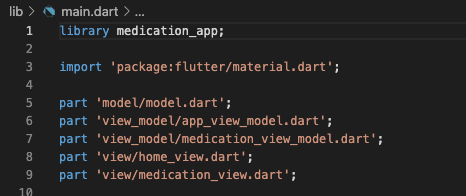

# Model-View-ViewModel Example

This in an example of how to design your app to follow the [Model–View–ViewModel](https://en.wikipedia.org/wiki/Model%E2%80%93view%E2%80%93viewmodel) software architecture. This entails that you divide ("separate") your app into three main types of components:

In our case, the Model contains the domain knowledge of the device(s), and the View contains all the Flutter widgets, and the ViewModel contains and enriches data from the Model to be shown in the View.

## User Interface

This simple example app shows a list of medication using a ListView widget, as shown below. When the user presses the "+" button, an additional medication (the "Hemangiol") is added to the list.

 

## Software Architecture

 As said, the app follows the Model-View-ViewModel (MVVM) architecture. In a Flutter app, a MVVM architecture is typically implemented by having "model", "view", and "view_model" folders in your app structure, like this:

The you create classes and dart files for;

* model(s) (sometimes just one BIG model)
* views
* view models for each view

Finally, you can use the `library` construct in Dart to bundle the entire app together;

Each type of component have different responsibilities:

* `Model` - The model is holding the “raw” data model and is divided into different model classes. The model knows where to get data and where to store data, e.g., in a database or a server, and knows about data formats, like JSON. See the [`model.dart`](https://github.com/bardram/22061-Introduction.to.Digital.Health/blob/6a7357da9c2b0c395aa57f2bb116e2f320701b64/mvvm/lib/model/model.dart) as an example.

* `ViewModel` - The view model is created knowing its model using “dependency injection”, which is typically done in the constructor. The view model is responsible for providing access to the data that “its” view model should be able to show and for updating the model based on user input from the view. See the [`medication_view_model.dart`](https://github.com/bardram/22061-Introduction.to.Digital.Health/blob/6a7357da9c2b0c395aa57f2bb116e2f320701b64/mvvm/lib/view_model/medication_view_model.dart) as an example.

* `View` - The view is created knowing its view model using “dependency injection” done in the constructor. The view is responsible for showing its data in the view model, which is done using the `State` of a `StatefulWidget`. The view is also responsible for mapping user input (like a button or text input) to the view model done by calling methods on the view model. See the [`medication_view.dart`](https://github.com/bardram/22061-Introduction.to.Digital.Health/blob/6a7357da9c2b0c395aa57f2bb116e2f320701b64/mvvm/lib/view/medication_view.dart) as an example.
