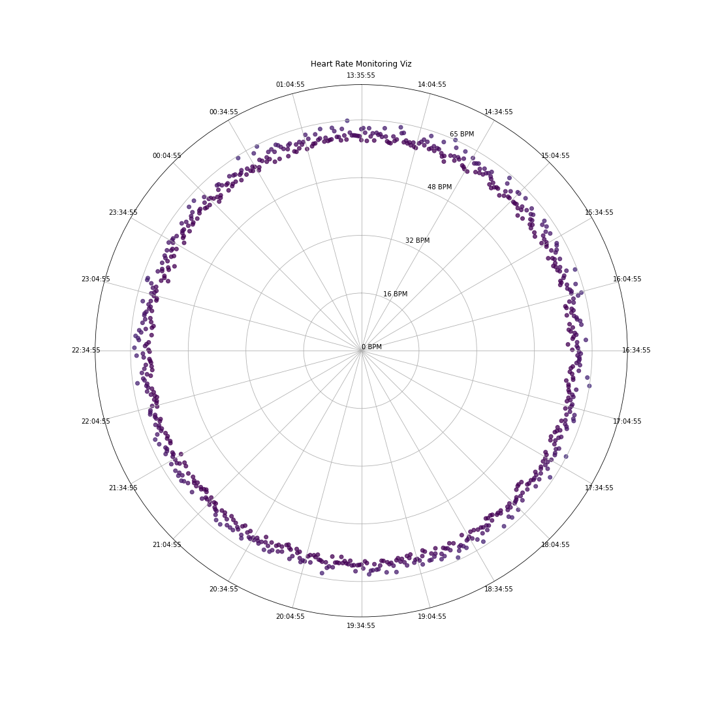

# Visualizing Long Term Heart Rate and Electrocardiogram Data

Use [`ecg.ipynb`](https://github.com/bardram/teaching_digital_mobile_health/blob/main/python_visualization/ecg.ipynb) to plot the ECG data

Use [`hr.ipynb`](https://github.com/bardram/teaching_digital_mobile_health/blob/main/python_visualization/hr.ipynb) to plot the Heart Rate data

