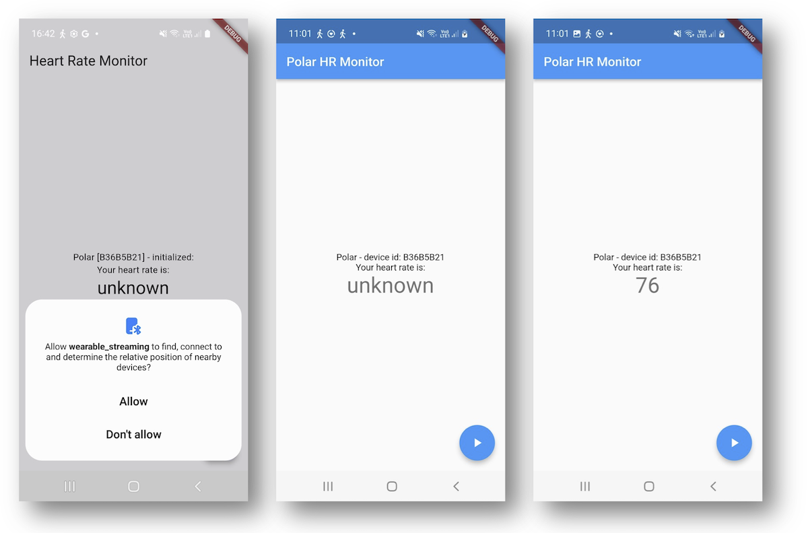

# Wearable Streaming

This project illustrates how to create a reactive Flutter app that listens to a sensor - in this case the Polar HR sensor. The app contains 4 different `main` files that each illustrates different levels of reactive programming in Flutter. The apps illustrate:

* how to obtain permissions to use Bluetooth (BLE)
* how to listen to listen to device events
* how to connect to a device
* how to do state management
* how to build reactive UI
* how to store data locally on the phone

## [`main_1`](lib/main_1.dart)

This HRApp is the most simple version of a HR demo app, highlighting:

* obtain permissions
* using a simple HR monitor `SimplePolarHRMonitor`
* starting the monitor from the FloatingActionButton
* displaying HR data in a StreamBuilder

Note that the user has to wait pressing the "start" button until the initialization has taken place, and that this isn't visible in the UI. Also note that once the sampling has started, it cannot be stopped again.

The UI is shown below. We see how permissions are shown, and that we can start listen to the sensor, but not stop it again.



The `SimplePolarHRMonitor` can:

* obtain permissions
* listen to device events
* start listening to a heart rate (HR) stream

### Permissions

Permissions are handled using [`permission_handler`](https://pub.dev/packages/permission_handler) plugin and are checked using this code:

```dart
  /// Do we have the required Bluetooth permissions?
  Future<bool> get hasPermissions async =>
      await Permission.bluetoothScan.isGranted &&
      await Permission.bluetoothConnect.isGranted;

  /// Request the required Bluetooth permissions.
  Future<void> requestPermissions() async => await [
        Permission.bluetooth,
        Permission.bluetoothScan,
        Permission.bluetoothConnect,
      ].request();
```

### Listening to Events and Connecting to Device

On the [Polar API](https://pub.dev/documentation/polar/latest/) you can listen to different events from the device. This is done in the `init()` method. In this version of the app, we don't use the events to anything and just prints a status message.

After listening has be set up, we connect to the device knowing its `identifier` - the ID printed on the side of the Polar device. Note that if don't know the device id, you can scan for Polar devices using the `searchForDevice()` method, which returns a stream to listen to.

```dart
  /// Initialize this HR monitor.
  Future<void> init() async {
    if (!(await hasPermissions)) await requestPermissions();

    polar
        .searchForDevice()
        .listen((event) => print('Found device in scan: ${event.deviceId}'));

    // Listen for life cycle events
    polar.deviceConnecting.listen(
        (event) => print('Connecting to device - id:${event.deviceId}'));
    polar.deviceConnected.listen((event) => print('Device connected'));
    polar.deviceDisconnected.listen((event) => print('Device disconnected'));

    // Listen for device characteristics
    polar.batteryLevel.listen((event) => print('Battery: ${event.level}'));
    polar.blePowerState.listen((event) => print('BLE Power State is: $event'));
    polar.disInformation
        .listen((event) => print('Device DIS info: ${event.info}'));
    polar.sdkFeatureReady
        .listen((event) => print('Device SDK Feature: ${event.feature}'));

    print('Connecting to device, id: $identifier');
    await polar.connectToDevice(identifier);
  }
  ```

> **NOTE** - Listening to event normally had to be setup up **before** connecting to the device (this is common to most BLE devices).

### Listen to HR Events

Now that we have initialized and connected to the device, we can start listen to HR events. This is done by;

```dart
  void start() {
    polar
        .startHrStreaming(identifier)
        .listen((PolarHrData event) => _controller.add(event.samples.first.hr));
  }
```

### User Interface

In the UI, the stream of HR events is shown using a StreamBuilder:

```dart
            StreamBuilder<int>(
                stream: monitor.heartbeat,
                builder: (BuildContext context, AsyncSnapshot<int> snapshot) {
                  var displayText = 'unknown';
                  if (snapshot.hasData) displayText = '${snapshot.data}';
                  return Text(
                    displayText,
                    style: Theme.of(context).textTheme.headlineMedium,
                  );
                }),
```

The start of the HR monitor is done by a FloatingButton:

```dart
      floatingActionButton: FloatingActionButton(
        tooltip: 'Start HR Monitor',
        child: const Icon(Icons.play_arrow),
        onPressed: () => monitor.start(),
      ),
```

As you can see, this button only knows how to start the HR monitor - and not how to stop it again.

## [`main_2`](lib/main_2.dart)

This is a slightly more advance HR Monitor (compared to `main_1`), featuring:

* defining an interface for a [HRMonitor]
* an implementation done as a [PolarHRMonitor]
* keeping track on device state in the enum [DeviceState]
* also supporting "stopping" the monitor from the FloatingActionButton
* the icon of the button is updated according to the state of the device
* displaying device states in the UI.

Since the PolarHRMonitor knows its own connection state, we can avoid starting sampling before the device is actually connected. See the `start()` method.

Note that this implementation still has the problem that the user needs to wait until the `init()` method has run before pressing the "Start" button.
Also note that the state of the device isn't updated correctly in the UI, and that update of the UI has to take place in a `setState()` Widget methods - which is bad coding :-(

### Defining the HR Monitor Interface

We now use an interface (abstract class) to defined what an HR monitor is:

```dart
/// A Heart Rate (HR) Monitor interface.
///
/// The [heartbeat] stream emits heart rate events as [int].
/// Can be started and stopped via the [start] and [stop] commands.
abstract class HRMonitor {
  /// The identifier of this monitor.
  String get identifier;

  /// The state of this monitor.
  DeviceState get state;

  /// The stream of heartbeat measures from this HR monitor.
  Stream<int> get heartbeat;

  /// Has this monitor been started via the [start] command?
  bool get isRunning;

  /// Initialize this HR monitor.
  Future<void> init();

  /// Start this HR monitor.
  void start();

  /// Stop this HR monitor.
  void stop();
}
```

Having this definition of an HR Monitor is super useful once we start using other physical devices - in this case we can "hide" the device-specific implementation is a sub-class that implements this interface. For example, the `PolarHRMonitor` class implements how we use the Polar device, but from the user interface, we don't need to worry about this - we can just use the abstract definition of a HR Monitor (see below).

### Keeping Track of Device State

Often we want to keep track of the state of a device - is it connected, disconnected, sampling data, etc.? We do this by making an `enum` of possible states:

```dart
/// An enumeration of know device states.
enum DeviceState {
  unknown,
  initialized,
  connecting,
  connected,
  sampling,
  disconnected,
}
```

The `PolarHRMonitor` now has a `state` variable which we can set as we get state events from the device (set up in the `init()` as before):

```dart
  @override
  Future<void> init() async {
    if (!(await hasPermissions)) await requestPermissions();

    polar.batteryLevel.listen((e) => print('Battery: ${e.level}'));

    polar.deviceConnecting.listen((_) {
      state = DeviceState.connecting;
      print('Device connecting');
    });
    polar.deviceConnected.listen((_) {
      state = DeviceState.connected;
      print('Device connected');
    });
    polar.deviceDisconnected.listen((_) {
      state = DeviceState.disconnected;
      print('Device disconnected');
    });

    state = DeviceState.initialized;

    print('Connecting to device: $identifier');
    await polar.connectToDevice(identifier);
  }
```

### User Interface

The UI of this updated app is shown below.


In the UI we can now use a `HRMonitor` (which we initialize to be a `PolarHRMonitor`):

```dart
class _HRHomePageState extends State<HRHomePage> {
  HRMonitor monitor = PolarHRMonitor('B36B5B21');

  @override
  void initState() {
    super.initState();
    monitor.init();
  }

  ...
```

We can now show the `state` of the device in the UI:

```dart
Text('Polar [${monitor.identifier}] - ${monitor.state.name}'),
```

In the UI figure we see that the state changes from "unknown" to "connected" to "sampling" as the state changes.

> **Note**, however, since this this `Text` widget is not embedded in a StreamBuilder or anything, the UI is actually not update when the state change from e.g. "connecting" to "connected". This is solved in `main_3` below.

The StreamBuilder that shows the HR is same as in `main_1`. But since we now know is the monitor `isRunning()`, we can now set the FloatingButton to show either a "play" button when it can start (i.e., not running) and a "stop" button when is can stop (i.e., is running):

```dart
      floatingActionButton: FloatingActionButton(
        onPressed: startOrStopHRMonitor,
        tooltip: 'Start/Stop HR Monitor',
        // Set the icon of the button to reflect if the HR monitor can be
        // started or stopped
        child: (monitor.isRunning)
            ? const Icon(Icons.stop)
            : const Icon(Icons.play_arrow),
      ),
```

In the picture above, we can see how the button has changed from showing a "play" to a "stop" icon based on the state of the monitor.

## [`main_3`](lib/main_3.dart)

This is the most advanced HR Monitor app solving some of the issues with `main_1` and `main_2`. This app:

* uses a [StatefulPolarHRMonitor] which has a stream of [stateChange]
* this stateChange stream is used to keep the UI updated according to the state of the monitor
* this also includes which icon to show on the button
* this allows us to AVOID USING the setState() Flutter method :-)

The updated `HRMonitor` interface now has a `stateChange` property which provides a stream of state changes:

```dart
/// A Heart Rate (HR) Monitor interface.
///
/// The [stateChange] streams state changes of this monitor.
/// The [heartbeat] stream emits heart rate events as [int].
/// Can be started and stopped via the [start] and [stop] commands.
abstract class HRMonitor {
  /// The identifier of this monitor.
  String get identifier;

  /// The state of this monitor.
  DeviceState get state;

  /// The stream of state changes of this monitor.
  Stream<DeviceState> get stateChange;

  /// The stream of heartbeat measures from this HR monitor.
  Stream<int> get heartbeat;

  /// Has this monitor been started via the [start] command?
  bool get isRunning;

  /// Initialize this HR monitor.
  Future<void> init();

  /// Start this HR monitor.
  void start();

  /// Stop this HR monitor.
  void stop();
}
```

### State Management

State management in the `StatefulPolarHRMonitor` is now done using a `StreamController`:

```dart
  DeviceState _state = DeviceState.unknown;

  final StreamController<DeviceState> _stateChangeController =
      StreamController.broadcast();

  set state(DeviceState state) {
    print('The device with id $identifier is ${state.name}.');
    _state = state;
    _stateChangeController.add(state);
  }

  @override
  DeviceState get state => _state;

  @override
  Stream<DeviceState> get stateChange => _stateChangeController.stream;
```

The state of the monitor is now save in the (private) `_state` property. We create a StreamController called `_stateChangeController` to handle state change events. A new state is set in the `set state(DeviceState state)` method. Here we print the state change, set the `_state` property, and then add an even to the state controller that an event has happened. This event will now be send out on the stream of the `_stateChangeController` and this stream can be accessed from the `stateChange` property. As before, the current state of the monitor can be accessed via the `state` property, which just return the internal / private `_state` property.

Now changing state based on the event from the Polar device becomes very simple:

```dart
    polar.deviceConnecting.listen((_) => state = DeviceState.connecting);
    polar.deviceConnected.listen((_) => state = DeviceState.connected);
    polar.deviceDisconnected.listen((_) => state = DeviceState.disconnected);
```

Note that since the `set state(...)` method prints the new device state, the previous ugly and repetitive print statements can be removed from the `listen` methods above.

### User Interface

Using the `stateChange` stream, we can now update the UI so the Text widget showing the state is wrapped in a StreamBuilder:

```dart
            StreamBuilder<DeviceState>(
              stream: monitor.stateChange,
              builder: (context, snapshot) => Text(
                  'Polar [${monitor.identifier}] - ${monitor.state.name}'),
            ),
```

And similarly, the FloatingButton widget can be updated to use this stream:

```dart
      floatingActionButton: FloatingActionButton(
        onPressed: () {
          if (monitor.isRunning) {
            monitor.stop();
          } else {
            monitor.start();
          }
        },
        tooltip: 'Start/Stop HR Monitor',
        child: StreamBuilder<DeviceState>(
          stream: monitor.stateChange,
          builder: (context, snapshot) => (monitor.isRunning)
              ? const Icon(Icons.stop)
              : const Icon(Icons.play_arrow),
        ),
      ),

```

By updating the icon on this button from the stream, we completely avoid using the ugly `setState()` method as we did in `main_1` and `main_2`.

Note that we actually don't use the value of the `stateChange` stream (what is called the `snapshot` in a StreamBuilder). We merely use the fact that "some" event has happened, and we update the UI by getting the current status directly from the `monitor`.

## [`main_4`](lib/main_4.dart)

This HR Monitor is a direct copy of main_3.dart but also supports saving HR data persistently on the phone using the [sembast](https://pub.dev/packages/sembast) database. Sembast is a document-based (or JSON-based) database that can store "plain" documents and key-value pairs, like JSON. Hence, if we have data in JSON format, such a document database is easy to use.

The main idea is to create a `Storage` class which is responsible for storing HR data. This storage class simply listen to the HR stream from the `HRMonitor` and saves the data. Here the ability to have multicast streams in Flutter comes into play, since both the UI and the Storage class listens to the same stream of HR data.

The `Storage` class is listed below, and there is plenty of code documentation to explain what is going on.

```dart

/// Responsible for storing HR event to a Sembast database.
class Storage {
  HRMonitor monitor;
  StoreRef? store;
  var database;

  /// Initialize this storage by identifying which [monitor] is should save
  /// data for.
  Storage(this.monitor);

  /// Initialize the storage by opening the database and listening to HR events.
  Future<void> init() async {
    print('Initializing storage, id: ${monitor.identifier}');

    // Get the application documents directory
    var dir = await getApplicationDocumentsDirectory();
    // Make sure it exists
    await dir.create(recursive: true);
    // Build the database path
    var path = join(dir.path, 'hr_monitor.db');
    // Open the database
    database = await databaseFactoryIo.openDatabase(path);

    // Create a store with the name of the identifier of the monitor and which
    // can hold maps indexed by an int.
    store = intMapStoreFactory.store(monitor.identifier);

    // Create a JSON object with the timestamp and HR:
    //   {timestamp: 1699880580494, hr: 57}
    Map<String, int> json = {};

    // Listen to the monitor's HR event and add them to the store.
    monitor.heartbeat.listen((int hr) {
      // Timestamp the HR reading.
      json['timestamp'] = DateTime.now().millisecondsSinceEpoch;
      json['hr'] = hr;

      // Add the json record to the database
      store?.add(database, json);
    });
  }
}
```

As you can see, the `Storage` class even handles subscription to the monitor itself (in the `init()` method). The only thing we need to do is to construct the Storage class and provide a link to the monitor it should save data for. This is done by this statement in the `StatefulPolarHRMonitor` constructor.

```dart
  StatefulPolarHRMonitor(this._identifier) {
    storage = Storage(this);
  }
```

We simply give the `storage` a link to the monitor which creates it (`this`).

Now that `storage` is created and knows "its" `monitor`, we can initialize storage as part of initializing the monitor:

```dart
  @override
  Future<void> init() async {
    if (!(await hasPermissions)) await requestPermissions();

    polar.batteryLevel.listen((e) => print('Battery: ${e.level}'));
    polar.deviceConnecting.listen((_) => state = DeviceState.connecting);
    polar.deviceConnected.listen((_) => state = DeviceState.connected);
    polar.deviceDisconnected.listen((_) => state = DeviceState.disconnected);

    state = DeviceState.initialized;

    await storage.init();
    await polar.connectToDevice(identifier);
  }
  ```

  Now - since storage is listening to HR events (just like the UI is), data is stored to the database, using the `store?.add(database, json)` statement. The json format of the stored data is a simple json map of `timestamp` and `hr` like this:

  ```json
  {timestamp: 1699880580494, hr: 57}
  ```
